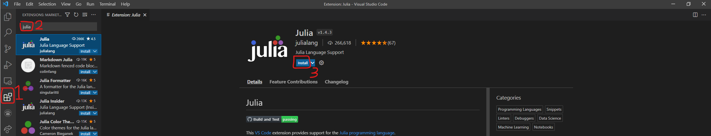
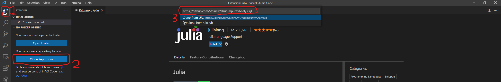
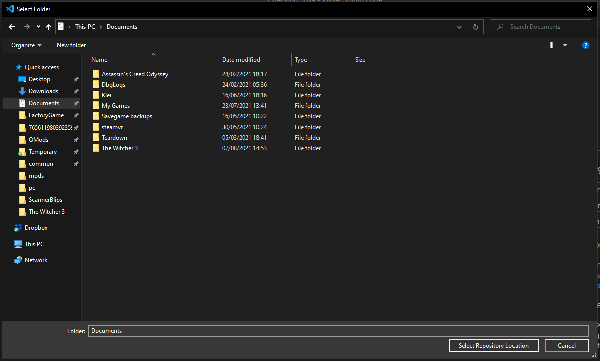

# DrugImpurityAnalysis.jl
 
This program can process gc-ms files of drugs, with the focus on cocaine. The program can detect adulterants and impurities in the drug sample, and determine the fraction compared to the major drug. This can be used to find similarities between, and link different samples.
  

### Requirements and Usage

This program has only been tested on Windows and on Julia version 1.6.1.

#### Conversion to .mzxml

The gc-ms files must have the .mzXML extension, gc-ms files can be converted to this extension using ProteoWizard: `http://proteowizard.sourceforge.net/download.html`  
Download ProteoWizard for your operation system, install it and note down the installation directory.
In the "extra" folder, .bat files are present to automatically convert agilent .D folders to .mzXML after installation of ProteoWizard, but the installation location of ProteoWizard must be set to the right folder in the .bat files.\
In the "convert_to_mzxml" bat files, replace `{MS_convert.exe location}` with the location of the MS_convert.exe file located in the installation directory, keep the qoutes. For example line 9 in `convert_to_mzxml.bat` could be: 
`"C:\Program Files\ProteoWizard\ProteoWizard 3.0.21193.ccb3e0136\" "*.D" "--mzXML" "--32"` 

The program supports importing sample metadata, the metadata is not present in the .mzxml files. So the .bat file automatically extracts the file containing the metadata from the .D files. The program can read this file. Optionally, if this file is not present, the program will try to find the metadata in the .D files, if present.

#### compounds.csv
compounds.csv should contain information about the major drug, impurities and adulterants.
- RT: The expected retention time of the compound.
- mz: Mass over charge values that the program should take into account, separated by a semicolon. Alternatively, the mz values can be put in brackets and separated by commas, the program will then take the sum of those mz values, instead of processing them separately.
- overlap: Manually define RT of peak that overlaps with this compound.
  

#### settings.json
In settings.json the following settings can be modified:
main_compound: Name of the main compound (must match a compound in compounds.csv)
internal_standard: Name of the internal standard (must match a compound in compounds.csv)
main/IS min ratio: Minimum ratio between integrals of main compound and internal standard. Samples with a ratio below this value will be ignored and not be present in the output.

output_metadata: Which metadata should be shown in the output.
type: Type of metadata, currently only "sample_info_xml" is supported.
header: Header under which the metadata is output.
element_name: Name of the element in the sample_info.xml file.

exclude_from_impurity_profile: Compounds listed here are not shown in the output
compound_groups: Custom grouping of compounds, can be used in analysis.

### Installation instructions for inexperienced users
1. Download Visual Studio Code (VSCode) here: `https://code.visualstudio.com/download`, if you want to install it for all users, use the system installer. Run it and follow the instructions, you can use the default settings.
2. Download Julia 1.6.3 here: `https://julialang.org/downloads/`, choose the right installer for your operating system. [Do I have 32-bit or 64-bit Windows?](https://support.microsoft.com/en-us/windows/32-bit-and-64-bit-windows-frequently-asked-questions-c6ca9541-8dce-4d48-0415-94a3faa2e13d)  
If you want to install Julia for all users, run the installer as administrator. Follow the instructions, you can use the default settings
3. Open VSCode if not already opened. (1) On the left click on Extensions (icon with squares), (2) search for Julia and (3) click install.

4. (1) On the left click on Explorer (file icon), (2) click on Clone Repository and (3) paste `https://github.com/SteinOv/DrugImpurityAnalysis.jl` into the bar that appeared and hit enter.

5. An explorer window will open where you will have to choose where to store the files. Go to the location where you want to store the files (Documents for example) and click on Select Repository Location.
   
6. You will get a prompt 'Would you like to Open the cloned repository', click on Open.
7. 